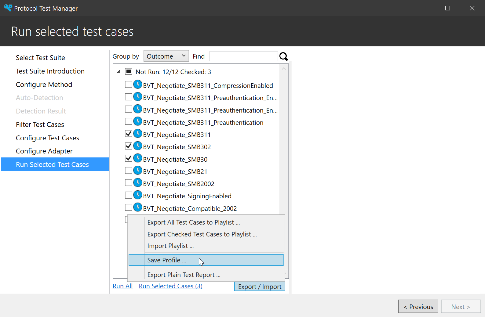

Protocol Test Manager has a command line interface **PTMCli** for you to use in automation.

It can be run on multiple operating systems: Windows, Linux and macOS.

Download PTMCli.zip/PTMCli.tar.gz and then extract it to your specified folder.
PTMCli.dll is inside the package.

## Syntax

```
cd <the folder that contains the extracted files>
dotnet PTMCli.dll <-p|--profile profilePath>
           <-t|--testsuite testsuitePath>
           [-s|--selected] [--categories categories]
           [-r|--report reportFile] [--outcome pass,fail,inconclusive]
           [-f|--format format]
```

## Parameters

### -p|--profile profilePath

Specifies the path of the test profile to run.

To get a valid profile. You need to export one from PTM GUI. See [Export Test Profile](#export-test-profile) section.

### -t|--testsuite testsuitePath

Specifies the path of the test suite to run.

### -s|--selected

When specified, only the selected test cases will be executed. Otherwise, all the test cases in the profile will be executed.

### --categories categories

Specifies the categories of test cases to run. This parameter overrides the test cases in profile.

Value should be separated by comma or space.

### -r|--report reportFile

Specifies the result file which will be written to. If not specified, test results will be written to stdout.

### --outcome outcome

Specifies the outcome of the test cases to be included in the report file.

Value should be separated by comma or space.

Valid values are: `pass`, `fail`, `inconclusive`.

Default value is `pass,fail,inconclusive`.

### -f|--format format

Specifies the report format.

Valid values are: `plain`, `json`, `xunit`.

Default value is `plain`.

## Export Test Profile

As the below image shown, when using PTM to run test cases, in the last screen, click **Export / Import** at the right bottom of the test case list, then click **Save Profile ...**. Then you can get a valid PTM profile to use with PtmCli.



## Modify Test Profile

If you want to run test suite using a different configuration, you can modify the test profile.

The test profile (.ptm file) itself is actually a zip file. Unzip the `.ptm` file, you will get two folders: `config` and `ptfconfig`.

In `config` folder, you can edit `playlist.xml` to update playlist and edit `profile.xml` to update the selected rules.

And all `ptfconfig` file used by test suites are located in `ptfconfig` folder, you can change them accordingly.

When you are ready, zip the folder and modify the extension to `.ptm`. You can use the new test profile to run test suites using the new configuration.

## Support multi-instance

PTMCli supports multi-instance, meaning that you can run multiple PTMCli at the same time.

For example, open two Console windows on Windows OS, and execute the commands below in each window.

```
dotnet PTMCli.dll -p C:\test1.ptm -t C:\FileServer-TestSuite-ServerEP
dotnet PTMCli.dll -p C:\test2.ptm -t C:\FileServer-TestSuite-ServerEP
```

You will get two results under `C:\FileServer-TestSuite-ServerEP\HtmlTestResults\`.