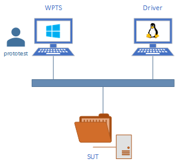

## Table of Contents

* [Overview](#overview)
* [Prerequisites](#prerequisites)
* [Testing Environment](#testing-environment)
* [Setup PowerShell Core](#setup-powershell-core)
    * [PowerShell Core on Windows](#powershell-core-on-windows)
    * [PowerShell Core on Linux](#powershell-core-on-linux)
* [Setup SSH Connection](#setup-ssh-connection)
    * [Install OpenSSH Server](#install-openssh-server)
    * [Configure SSH Server](#configure-ssh-server)
    * [Generate SSH keys](#generate-ssh-keys)
    * [Test Connectivity](#test-connectivity)
* [Remotely Trigger Test Suite](#remotely-trigger-test-suite)
    * [Register a Scheduled Task](#register-a-scheduled-task)
    * [Schedule the Task](#schedule-the-task)
    * [Query Task Status](#query-task-status)

## Overview

Windows Protocol Test Suites currently only runs on Windows. You can use it interactively as a GUI application. It also can be run via CLI for auto testing purpose.

This guide will show you how to run Windows Protocol Test Suites remotely from a Linux machine through PowerShell Core. So you can integrate Windows Protocol Test Suites into your own testing environment for automation.

## Prerequisites

1. A Windows machine with Protocol Test Manager, Windows Protocol Test Suites and all its prerequisites installed.
2. A test profile saved from Protocol Test Manager.

## Testing Environment

The graph below shows the testing environment used in this guide.



`SUT` is the machine to be tested against the test suite.

`Driver` is the Linux machine which triggers the testing.

The test suite runs on the Windows machine `WPTS`, and the user we use in this guide called `prototest`.

## Setup PowerShell Core

In order to establish connection between machines with different operating systems, we leverage PowerShell Core for its cross-platform flexibility.

### PowerShell Core on Windows

Download msi installer from PowerShell Core [GitHub release page](https://github.com/PowerShell/PowerShell/releases), and install it.

### PowerShell Core on Linux

You may refer to the [official guide](https://docs.microsoft.com/en-us/powershell/scripting/setup/installing-powershell-core-on-linux?view=powershell-6) on how to install PowerShell Core in your distribution.

## Setup SSH Connection

### Install OpenSSH Server

* Windows 10 Fall Creators Update and Later

Since Fall Creators Update (10.0.16299), you can install OpenSSH in Windows as an optional feature.

In PowerShell, run:

```powershell
Add-WindowsCapability -Online -Name OpenSSH.Server~~~~0.0.1.0
```

* Windows 10 Creators Update and Earlier

Get the zip file from [GitHub](https://github.com/PowerShell/Win32-OpenSSH/releases), extract it.

### Configure SSH Server

The sshd configuration file is located at `%programdata%\ssh\sshd_config`, by default, it is `C:\ProgramData\ssh\sshd_config`.

Edit the file:

Enable key authentication:

    PubkeyAuthentication yes

Add a PowerShell subsystem entry:

    Subsystem powershell C:/Program Files/PowerShell/6/pwsh.exe -sshs -NoLogo -NoProfile

Please adjust the path of PowerShell binary if you are not using the default one.

After editing the SSH server configuration file, restart the sshd service.

### Setup SSH keys

1. Generate a new SSH key on Linux machine

Open terminal, and invoke `ssh-keygen` to generate the key. The generated keys are located in `~/.ssh/` directory.

2. Copy the public key to Windows

Use the following command to copy SSH key:

```sh
$ ssh-copy-id prototest@WPTS
```

This will grant access by adding the public key to the `%HOME%\.ssh\authorized_keys` file on Windows.

### Test Connectivity

Once the key has been copied, you are able to use public key authentication to login to the Windows machine from the Linux machine. You can verify the connectivity using SSH.

```sh
$ ssh prototest@WPTS
```

This should succeed and you are now in a Windows shell.

And open a PowerShell Core instance.

```PowerShell
Enter-PSSession -HostName WPTS -UserName prototest
```

Using this command, you are able to login to the Windows machine using PowerShell Core from Linux.

## Remotely Trigger Test Suite

Since there will be some popup windows showing detailed testing log, running test suites directly in a remote session will not work. We decided to use scheduled tasks to run test suite. The idea is to register a task, and start it when you want to run test suite.

### Register a Scheduled Task

First, regesiter a scheduled task.

```
schtasks /Create /TN ProtoTest /TR "'C:\Program Files\Protocol Test Manager\bin\PtmCli.exe' -p C:\ProtoTest\automation.ptm -r C:\ProtoTest\result.txt" /SC ONCE /SD 01/01/2000 /ST 00:00
```

`/TN` specifies the task name. `/TR` specifies the command to run. Here we use the test profile located at `C:\ProtoTest\automation.ptm` and the final results will write to `C:\ProtoTest\result.txt`. To create a scheduled task, a scheduled time must be set. `/SC` and `/ST` set the time when the task will be invoked. Here we only want to trigger the test manually, as a result we set a time in the past so that the task will not be automatically triggered.

### Schedule the Task

You can run the following commands on the Linux machine.

```PowerShell
$blk = {
    schtasks /Run /TN ProtoTest
}

$session = New-PSSession -HostName WPTS -UserName prototest
Invoke-Command -ScriptBlock $blk -Session $session
```

It create a session to the Windows machine, and trigger the task registered before.

Now the test suite will be running on the Windows machine.

### Query Task Status

You can use the following script to query whether the task is still running or it has already finished.

```PowerShell
$blk = {
    schtasks /Query /TN ProtoTest
}

$session = New-PSSession -HostName WPTS -UserName prototest
Invoke-Command -ScriptBlock $blk -Session $session
```

You will get the output like below:

```
Folder: \
TaskName                                 Next Run Time          Status         
======================================== ====================== ===============
ProtoTest                                N/A                    Running   
```

If the status says Running, it means testing is still in progress. If the status says Ready, it means it is not running, thus testing is done. You can copy the result file using `scp`.