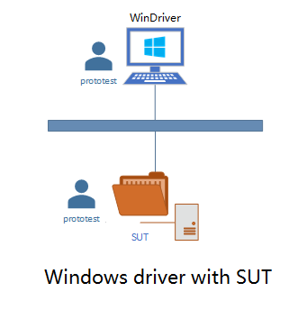

## Table of Contents

* [Overview](#overview)
* [Prerequisites](#prerequisites)
* [Testing Environment](#testing-environment)
* [Setup PowerShell Core](#setup-powershell-core)
    * [PowerShell Core on Windows](#powershell-core-on-windows)
    * [PowerShell Core on Linux](#powershell-core-on-linux)
* [Setup SSH Connection](#setup-ssh-connection)
    * [Install OpenSSH Server on SUT](#install-openssh-server-on-windows-sut)
    * [Configure SSH Server on SUT](#configure-ssh-server-on-windows-sut)
    * [Setup SSH keys on driver machine](#setup-ssh-keys-on-driver-machine)
    * [Test Connectivity](#test-connectivity)
* [Run Test Suite on Linux or Windows driver](#run-test-suite-on-linux-or-windows-driver)
    * [Run Test Suite](#run-test-suite)

## Overview

.NET Core version of Windows Protocol Test Suites currently can run on Windows and Linux, and we publish [.NET Core FileServer TestSuite](./Run-.NET-Core-File-Server-Test-Suite-on-Cross-Platforms.md),[.NET Core RDPClient TestSuite](./Run-.NET-Core-RDP-Client-Test-Suite-on-Cross-Platforms.md) and [.NET Core RDPServer TestSuite](./Run-.NET-Core-RDP-Server-Test-Suite-on-Cross-Platforms.md) at present.

This guide will show you how to enable [PowerShell Core remoting over SSH](https://docs.microsoft.com/en-us/powershell/scripting/learn/remoting/ssh-remoting-in-powershell-core?view=powershell-7.1).

## Prerequisites

Refer to [Prerequisites](https://github.com/microsoft/WindowsProtocolTestSuites#prerequisites)

## Testing Environment

The graph below shows the testing environment used in this guide.




`SUT` is the machine to be tested against the test suite, and it acts as SSH server and supports PowerShell remoting.

The test suite runs on the Linux machine `LinuxDriver` or the Windows driver machine `WinDriver`, and the driver acts as SSH client, and the driver and SUT user we use in this guide called `prototest`.

**Note:**

1. In this guide, the users on both driver and SUT are called "prototest".  It's fine to use different users on driver machine and SUT. You can use your current users in the driver and SUT.
The only restriction is that, to make sure the SUT user's 'authorized_keys' file under `.ssh` home directory is copied from your LinuxDriver or WinDriver user's id_rsa.pub under `.ssh` home directory.
The 'authorized_keys' file and SSH keys are the keys which you will use in [Setup SSH keys on driver machine](#setup-ssh-keys-on-driver-machine), and they are required for SSH authentication and authorization.

2. If you have many id_rsa.pub from multiple machines or users, you can just append authorized_keys file mentioned in note 1.

## Setup PowerShell Core

In order to establish connection between machines with different operating systems, we leverage PowerShell Core for its cross-platform flexibility.

### PowerShell Core on Windows

Download msi installer from PowerShell Core [GitHub release page](https://github.com/PowerShell/PowerShell/releases), and install it.

### PowerShell Core on Linux

You may refer to the [official guide](https://docs.microsoft.com/en-us/powershell/scripting/install/installing-powershell-core-on-linux?view=powershell-7.1) on how to install PowerShell Core in your distribution.

## Setup SSH Connection

### Install OpenSSH Server on SUT

* Windows Server 2012 R2 or later

Since Windows Server 2012 R2, you can download and install [OpenSSH-Win64](https://github.com/PowerShell/Win32-OpenSSH/releases) on Windows.

In native PowerShell, create and run below `.\install.ps1` powershell script under the extracted folder from OpenSSH-Win64.zip like `C:\OpenSSH-Win64`:

```powershell
# Add C:\OpenSSH-Win64 into 'PATH' environment variable
$mydir=Split-Path $MyInvocation.MyCommand.Path -Parent
$INCLUDE = "$mydir"
$OLDPATH = [System.Environment]::GetEnvironmentVariable('PATH','machine')
$NEWPATH = "$OLDPATH;$INCLUDE"
[Environment]::SetEnvironmentVariable("PATH", "$NEWPATH", "Machine")

# Install sshd
& "$mydir\install-sshd.ps1"

# Fixes user file permisions
& "$mydir\FixUserFilePermissions.ps1"

# Fixes host keys permissions
& "$mydir\FixHostFilePermissions.ps1"

# Start sshd service
Start-Service sshd

# OPTIONAL but recommended:
Set-Service -Name sshd -StartupType 'Automatic'

# Confirm the Firewall rule is configured. It should be created automatically by setup.
Get-NetFirewallRule -Name *ssh*

# There should be a firewall rule named "OpenSSH-Server-In-TCP", which should be enabled
# If the firewall does not exist, create one
New-NetFirewallRule -Name sshd -DisplayName 'OpenSSH Server (sshd)' -Enabled True -Direction Inbound -Protocol TCP -Action Allow -LocalPort 22

# Set OpenSSH as powershell default shell
New-ItemProperty -Path "HKLM:\SOFTWARE\OpenSSH" -Name DefaultShell -Value "C:\Windows\System32\WindowsPowerShell\v1.0\powershell.exe" -PropertyType String -Force

# Restart sshd service
Restart-Service sshd
```

### Configure SSH Server on SUT

The sshd configuration file is located at `%programdata%\ssh\sshd_config`, by default, it is `C:\ProgramData\ssh\sshd_config`.

Edit the file:

Enable key authentication:

    PubkeyAuthentication yes

Add a PowerShell subsystem entry:

    Subsystem	powershell	c:/progra~1/PowerShell/7/pwsh.exe -sshs -NoLogo

Please adjust the path of PowerShell binary if you are not using the default one.

Comment below content:

    #Match Group administrators
    #       AuthorizedKeysFile __PROGRAMDATA__/ssh/administrators_authorized_keys

After editing the SSH server configuration file, restart the sshd service.

### Setup SSH keys on driver machine

1. Generate a new SSH key on Linux or Windows driver machine

Open terminal or command line, and invoke `ssh-keygen` to generate the key. The generated keys are located in `~/.ssh/` directory on Linux or under `%HOME%\.ssh` directory on Windows.

**Note:**

a. In order to use ssh-keygen.exe and ssh.exe on Windows driver machine, you can just extract OpenSSH-Win64.zip to `C:\` and add `C:\OpenSSH-Win64` into 'PATH' environment variable.

b. If you are Linux driver, you need to set permission `chmod 0600 -R ~/.ssh` to use PowerShell Core remoting.

c. In order to automate the PowerShell Core remoting without host key interactive confirmation, you need to create a 'config' file under `~/.ssh/` directory on Linux or under `%HOME%\.ssh` directory on Windows.
```
Host *
    StrictHostKeyChecking no
    UserKnownHostsFile=/dev/null
```

2. Copy the public key to SUT

**Linux driver:**

Use the following command to copy SSH key:

```sh
$ ssh-copy-id prototest@SUT
```

**Windows driver:**

Windows SUT:

Copy SSH key from `%HOME%\.ssh\id_rsa.pub` on Windows driver to `%HOME%\.ssh\authorized_keys` on Windows SUT.

This will grant access by adding the public key to the `%HOME%\.ssh\authorized_keys` file on Windows SUT.

Linux SUT:

Copy SSH key from `%HOME%\.ssh\id_rsa.pub` on Windows driver to `~/.ssh/authorized_keys` on Linux SUT.

This will grant access by adding the public key to the `~/.ssh/authorized_keys` file on Linux SUT.

### Test Connectivity

Once the key has been copied, you can use public key authentication to login to the SUT machine from the Linux driver or Windows driver machine. You can verify the connectivity using SSH.

```sh
$ ssh prototest@SUT
```

This should succeed and you are now in a Windows shell.

And open a PowerShell Core instance.

```PowerShell
Enter-PSSession -HostName SUT -UserName prototest
```

Using this command, you are able to login to the SUT machine using PowerShell Core from Linux or Windows driver machine.

## Run Test Suite on Linux or Windows driver

### Run Test Suite

We can run .NET Core version of Test Suite like [.NET Core FileServer TestSuite](./Run-.NET-Core-File-Server-Test-Suite-on-Cross-Platforms.md) on Windows or Linux driver.